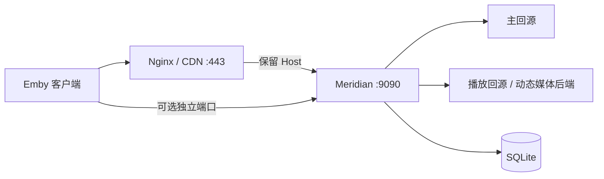

<div align="center">

# Meridian

轻量级 Emby 多站点反向代理管理面板

单二进制 · 内嵌 SPA · SQLite · 无 CGO

[](https://github.com/snnabb/Meridian/releases/latest)
[](https://go.dev)
[](https://github.com/snnabb/Meridian/actions/workflows/ci.yml)
[](https://github.com/snnabb/Meridian/pkgs/container/meridian)
[](LICENSE)

[快速开始](#快速开始) · [功能概览](#功能概览) · [部署方式](#其他部署方式) · [更新记录](CHANGELOG.md) · [安全说明](SECURITY.md)

</div>

Meridian 把多站点反代、UA 身份、流量管控和故障诊断整合进一个管理面板。适合希望直接部署、不想手写多套反代配置的个人或小型 Emby 环境。

最新发布：`v1.12.4`。当前版本统一采用双向流量计费（入站 + 出站，各计算一次），支持可选独立播放回源地址、响应式趋势图、三档自动发现、线路级 HTTP/HTTPS 配置、标准 IANA 调度时区、Cloudflare DNS-01 泛域名证书，以及账户变更后的旧会话失效。

## 界面预览

<table>
  <tr>
    <td align="center"><a href="docs/images/dashboard.png"></a><br><strong>仪表盘</strong></td>
    <td align="center"><a href="docs/images/sites.png"></a><br><strong>站点管理</strong></td>
  </tr>
  <tr>
    <td align="center"><a href="docs/images/site-create.png"></a><br><strong>站点编辑器</strong></td>
    <td align="center"><a href="docs/images/global-settings-ui.png"></a><br><strong>全局设置</strong></td>
  </tr>
  <tr>
    <td align="center" colspan="2"><a href="docs/images/request-logs.png"></a><br><strong>请求日志</strong></td>
  </tr>
</table>

<p align="center"><sub>截图来自 v1.12.2 临时全新数据库，未添加任何站点；点击图片查看原图。</sub></p>

## 功能概览

| 能力 | 说明 |
|---|---|
| **多站点反代** | 每个站点独立配置入口、回源、限速和流量配额 |
| **自动后端发现** | Safe、Compatible、Extreme 三档模式自动选择 30x、PlaybackInfo、HLS、DASH 处理范围，并通过同源加密 capability 代理公网媒体后端 |
| **身份与请求头** | 内置 UA 预设、自定义或透传模式；固定上游 Header 加密存储且不跨 authority 泄漏 |
| **实时监控** | 按站点统计流量、限速和配额，SSE 实时更新仪表盘 |
| **趋势与时区** | 速度、请求和流量趋势使用非负计费边界；日志、定时任务和趋势统一按所选 IANA 时区显示 |
| **公开入口地址** | 站点路径入口跟随当前浏览器公开 Origin，适配 HTTPS 反向代理 |
| **多入口模式** | 支持独立端口、路径入口、域名前缀入口，以及兼容模式；共享入口只接受精确 Host |
| **线路容灾** | 主线路加最多 7 条备用线路；每条线路独立选择 HTTP/HTTPS、地址和端口，支持顺序切换、恢复回切、测速和延迟分级显示 |
| **播放兼容** | 支持 UA 预设/自定义/透传、真实客户端 IP、自动播放后端发现、受限重定向跟随和 HLS/DASH 兼容 |
| **TLS 与证书** | 安装器可申请面板精确域名证书；面板内可使用 Cloudflare DNS-01 申请 `*.example.com` 泛域名证书并自动续签 |
| **全局设置** | 双向（入站 + 出站）或仅出站计费、流量周期、调度时区、探测缓存、日志字段和 UI 圆角等设置 |
| **备份恢复** | 加密导出/恢复站点、账户、流量、日志、全局设置和 Telegram；TLS 数据需显式勾选 |
| **通知与账户** | Telegram 日报、单管理员账户设置、密码/用户名修改后旧会话立即失效；1 分钟内连续 5 次失败会锁定 60 秒并显示倒计时 |
| **故障诊断** | 检查主回源、播放回源、TLS 证书和实际生效的 UA 配置 |
| **轻量部署** | 单文件 Go 后端、原生前端、嵌入式 SQLite，无外部数据库和前端构建链 |

## 快速开始

### Linux / macOS 一键安装

```bash
bash <(curl -fsSL https://raw.githubusercontent.com/snnabb/Meridian/master/install.sh)
```

脚本会进入四项菜单：安装、更新、修改管理员密码、卸载。选择“安装”后可直接输入管理面板端口；留空时首次安装默认使用 `9090`，已有安装则保留当前端口。首次安装会自动补齐 `curl`、证书、校验和文本处理等基础依赖；若 Release 带 Sigstore 签名，脚本会下载并校验固定版本的临时 cosign，再验证 `SHA256SUMS` 签名，无需用户预装 cosign。Linux systemd 部署默认使用独立的非 root 用户。

安装完成后：

1. 未配置域名时，安装器默认只绑定 `127.0.0.1`，请通过 HTTPS 反向代理访问；配置域名后访问对应的 HTTPS 地址。安装器申请的是面板精确域名证书；共享站点入口需要泛域名证书时，请在登录面板后进入“全局设置 → TLS 设置”完成 Cloudflare DNS-01 申请。若确需临时直接暴露明文 HTTP，必须显式设置 `ALLOW_INSECURE_HTTP=true`，不建议用于生产环境。
2. 输入 1–64 个 UTF-8 字节的管理员账号、12–72 个 UTF-8 字节的密码并再次确认，以及安装时显示的初始化令牌。
3. 创建站点，选择入口模式，并按“协议、地址、端口”配置主线路和备用线路；HTTPS 新线路默认端口为 443。

> [!IMPORTANT]
> `SETUP_TOKEN` 等同于首次管理员创建权限。安装器将其保存在权限受限的 `/opt/meridian/.env`，新生成时只显示一次；若初始化仍待完成且安装器提示令牌已存在，root 可从该文件恢复。请同时存入密码管理器，不要放进 Issue、日志或截图。管理页面不会读取或返回服务端令牌。

<details>
<summary><strong>常用管理命令</strong></summary>

```bash
# 安装；可在交互流程中配置面板 HTTPS 域名
bash <(curl -fsSL https://raw.githubusercontent.com/snnabb/Meridian/master/install.sh) install

# 非交互安装并自定义管理面板端口
bash <(curl -fsSL https://raw.githubusercontent.com/snnabb/Meridian/master/install.sh) install \
  --port 18090 -y

# 非交互安装并配置面板域名
bash <(curl -fsSL https://raw.githubusercontent.com/snnabb/Meridian/master/install.sh) install \
  --port 18090 --domain panel.example.com --email admin@example.com -y

# 更新；自动备份、健康检查，失败时回滚
bash <(curl -fsSL https://raw.githubusercontent.com/snnabb/Meridian/master/install.sh) update

# 隐藏输入新密码，并轮换 JWT_SECRET
bash <(curl -fsSL https://raw.githubusercontent.com/snnabb/Meridian/master/install.sh) password

# 卸载并保留数据；只有添加 --purge 才删除数据目录
bash <(curl -fsSL https://raw.githubusercontent.com/snnabb/Meridian/master/install.sh) uninstall
```

Linux 可自动安装或复用 Nginx、Certbot，并为管理面板配置 HTTPS。`--port` 支持 `1-65535`；首次安装默认使用 `9090`，对已有安装再次执行 `install --port PORT` 可切换面板端口。切换已有 HTTPS 面板时只更新 Meridian 管理的 `proxy_pass` 目标，会保留证书、443 配置和 Certbot 重定向。生成的 Nginx 配置只代理管理端口，不读取或修改站点回源和独立监听端口。macOS 支持安装，但不支持自动域名配置。

</details>

## 面板功能说明

| 页面 | 主要功能 |
|---|---|
| **仪表盘** | 站点运行状态、实时连接、速度/请求/流量趋势、日志健康、Telegram 定时任务和当日概览；支持按站点和时间范围查看 |
| **站点管理** | 添加、编辑、启停、删除和排序站点；显示入口地址、回源状态、流量额度、限速、缓存和线路延迟 |
| **站点编辑器** | 配置入口模式、路径/域名前缀、可选独立播放回源地址，以及采用独立协议/地址/端口字段的主线路和备用线路；自动发现只需选择三档模式，不再暴露无效的来源组合 |
| **日志记录** | 按站点、状态、资源类别和关键词检索请求；可控制写入字段和页面展示字段，日志不保存查询参数、令牌、Cookie 或正文 |
| **故障诊断** | 分别检查主回源、播放回源、备用线路、TLS、UA/请求头和本地代理状态；探针可达不等同于完整 Emby 播放可用 |
| **全局设置** | 系统/UI、流量周期、IANA 调度时区、健康探测、日志存储及日志字段设置 |
| **TLS 设置** | 配置面板前缀、节点泛域名和监听端口，使用 Cloudflare API Token 通过 DNS-01 申请和续签泛域名证书 |
| **备份与恢复** | 创建密码保护的加密备份；恢复前进行解密、结构和 SQLite 完整性检查，并按备份内容决定是否替换 TLS 数据 |
| **Telegram 日报** | 配置 Bot Token、Chat ID、每日/每周时间和星期，按全局时区发送统计摘要 |
| **账户** | 查看账户信息，修改管理员用户名或密码，退出当前设备会话 |

### Cloudflare 泛域名证书

面板内置的证书申请目前使用 Cloudflare DNS-01，申请范围为节点泛域名，例如 `*.example.com`。使用前请满足：

1. `panel.example.com` 和站点入口使用的子域名属于同一个 Cloudflare Zone，并按实际入口解析到 Meridian 或前置反向代理。
2. 在 Cloudflare 创建 API Token，至少授予目标 Zone 的 **Zone Read** 和 **DNS Edit** 权限；不要使用全局 API Key。
3. 在“全局设置 → TLS 设置”填写面板前缀、泛域名、ACME 邮箱和 Token，先保存域名设置，再点击“申请证书”。
4. Token 只用于 DNS-01 验证，数据库中以加密密文保存，管理 API 不返回原文；生产环境必须固定 `MERIDIAN_SECRET_KEY`，否则重启或迁移后无法解密已保存凭据。

证书申请支持 Let's Encrypt 生产环境和测试环境。申请成功后，若监听端口或 TLS 状态需要重新加载，页面会提示重启；自动续签由 Meridian 定时检查，当前 DNS 提供商实现为 Cloudflare。

## 其他部署方式

<details>
<summary><strong>Docker Compose</strong></summary>

先生成四个互不相同的密钥，并保存到权限受限的 `.env`：

```bash
mkdir meridian && cd meridian
umask 077
JWT_SECRET="$(openssl rand -hex 32)"
UPSTREAM_HEADER_KEY="$(openssl rand -hex 32)"
DYNAMIC_ROUTE_KEY="$(openssl rand -hex 32)"
MERIDIAN_SECRET_KEY="$(openssl rand -hex 32)"
SETUP_TOKEN="$(openssl rand -hex 32)"
cat > .env <<EOF
JWT_SECRET=$JWT_SECRET
UPSTREAM_HEADER_KEY=$UPSTREAM_HEADER_KEY
DYNAMIC_ROUTE_KEY=$DYNAMIC_ROUTE_KEY
MERIDIAN_SECRET_KEY=$MERIDIAN_SECRET_KEY
SETUP_TOKEN=$SETUP_TOKEN
EOF
chmod 600 .env
printf '首次初始化令牌：%s\n' "$SETUP_TOKEN"
unset JWT_SECRET UPSTREAM_HEADER_KEY DYNAMIC_ROUTE_KEY MERIDIAN_SECRET_KEY SETUP_TOKEN
```

创建 `compose.yaml`：

```yaml
services:
  meridian:
    image: ghcr.io/snnabb/meridian:latest
    restart: unless-stopped
    read_only: true
    cap_drop:
      - ALL
    security_opt:
      - no-new-privileges:true
    tmpfs:
      - /tmp:rw,noexec,nosuid,size=16m
    ulimits:
      nofile:
        soft: 65536
        hard: 65536
    ports:
      - "127.0.0.1:9090:9090"
      - "8001-8010:8001-8010"
    volumes:
      - meridian-data:/app/data
    env_file:
      - .env
    environment:
      PANEL_BIND_ADDR: 0.0.0.0
      ALLOW_INSECURE_HTTP: "true"

volumes:
  meridian-data:
```

```bash
docker compose up -d
```

`PANEL_BIND_ADDR=0.0.0.0` 只让面板监听容器网络，`ALLOW_INSECURE_HTTP=true` 只允许反向代理到容器的内部 HTTP 跳；宿主机仍通过 `127.0.0.1:9090:9090` 限制为回环访问。不要把该端口映射改成公网地址后继续使用明文 HTTP。`8001-8010` 是示例站点端口范围，请按实际配置调整。建议由 HTTPS 反向代理对外提供管理面板；使用共享域名入口时，还需把 `TRUSTED_PROXY_CIDRS` 精确设置为实际代理 peer 网段，不要使用 `0.0.0.0/0`。

请备份 `.env` 和数据卷。不要把 `.env` 提交到版本库，也不要在重建容器时重新生成长期密钥。

</details>

<details>
<summary><strong>Windows</strong></summary>

```powershell
Invoke-WebRequest -Uri "https://github.com/snnabb/Meridian/releases/latest/download/meridian-windows-amd64.exe" -OutFile "meridian.exe"
function New-MeridianSecret {
    $bytes = New-Object byte[] 32
    [System.Security.Cryptography.RandomNumberGenerator]::Create().GetBytes($bytes)
    -join ($bytes | ForEach-Object { $_.ToString('x2') })
}
$env:JWT_SECRET = New-MeridianSecret
$env:UPSTREAM_HEADER_KEY = New-MeridianSecret
$env:DYNAMIC_ROUTE_KEY = New-MeridianSecret
$env:SETUP_TOKEN = New-MeridianSecret
.\meridian.exe
```

请用服务管理器或受保护的系统配置长期保存这些密钥，重启时继续使用原值。Windows 不提供 Unix `0600` 等价保证，数据库目录的访问权限需要由管理员单独限制。

</details>

<details>
<summary><strong>从源码构建</strong></summary>

需要 Go 1.26.6 或更高版本：

```bash
git clone https://github.com/snnabb/Meridian.git
cd Meridian
go build -trimpath -buildvcs=false -o meridian ./cmd/meridian
export JWT_SECRET="$(openssl rand -hex 32)"
export UPSTREAM_HEADER_KEY="$(openssl rand -hex 32)"
export DYNAMIC_ROUTE_KEY="$(openssl rand -hex 32)"
export SETUP_TOKEN="$(openssl rand -hex 32)"
./meridian
```

生产部署必须把四个值存入权限受限的持久配置；不要在每次启动时重新生成。

</details>

## 基础配置

### 命令行

```bash
./meridian                          # 默认监听 127.0.0.1:9090，数据库在当前目录
./meridian --port 8080              # 自定义管理端口
./meridian --db /data/meridian.db   # 自定义数据库路径
```

### 环境变量

| 变量 | 默认值 | 用途 |
|---|---|---|
| `PORT` | `9090` | 管理面板和共享 Host 入口的端口 |
| `DB_PATH` | `meridian.db` | SQLite 数据库路径 |
| `PANEL_BIND_ADDR` | `127.0.0.1` | 面板与共享入口的绑定地址；公网绑定必须启用 HTTPS，或显式设置 `ALLOW_INSECURE_HTTP=true` |
| `PANEL_DOMAIN` | 空 | 管理面板唯一允许域名；设置后未知 Host 返回 `421` |
| `TRUSTED_PROXY_CIDRS` | 空 | 可信入口代理的精确 CIDR 列表，逗号分隔 |
| `JWT_SECRET` | 启动时随机 | 至少 32 字节；生产环境必须固定，否则重启后所有会话失效 |
| `UPSTREAM_HEADER_KEY` | 空 | 至少 32 字节；加密固定上游 Header |
| `MERIDIAN_SECRET_KEY` | 空 | 至少 32 字节；独立加密 Cloudflare/Telegram 凭据，生产环境建议固定 |
| `DYNAMIC_ROUTE_KEY` | 空 | 至少 32 字节；签发自动发现 capability |
| `SETUP_TOKEN` | 无 | 首次创建管理员前必须提供的一次性初始化凭据 |
| `ALLOW_INSECURE_HTTP` | `false` | 仅用于明确接受风险的公网明文 HTTP 兼容部署；默认拒绝 |

四个长期密钥必须两两不同，并与 SQLite 数据一起备份。丢失 `UPSTREAM_HEADER_KEY` 会让已有加密 Header 无法解密；丢失 `MERIDIAN_SECRET_KEY` 会让已保存的 Cloudflare/Telegram 凭据无法解密；轮换 `DYNAMIC_ROUTE_KEY` 会让正在使用的 capability 立即失效。一键安装器会生成并维护这些值。

### 流量计费

默认“入站 + 出站”模式会把客户端上传到 Meridian 的代理载荷字节与 Meridian 返回给客户端的代理载荷字节各计算一次，即 `入站 + 出站`，不会再额外乘以 2。“仅出站”模式只计算返回给客户端的字节。站点配额、总览、趋势图和 Telegram 报告统一使用所选模式。

<details>
<summary><strong>离线重置管理员密码</strong></summary>

数据库必须恰好包含一个管理员，并且服务应先停止：

```bash
read -r -s -p '新密码: ' ADMIN_PASSWORD; echo
printf '%s\n' "$ADMIN_PASSWORD" | ./meridian admin reset-password \
  --db /data/meridian.db --password-stdin
unset ADMIN_PASSWORD
```

systemd 部署优先使用安装器的 `password` 操作；它会先备份数据库，再原子轮换 `JWT_SECRET`、重启并执行健康检查。

</details>

## 高级功能

### 自动播放后端发现

自动发现按站点启用，需要 `DYNAMIC_ROUTE_KEY`。新站点默认使用 **Compatible**；明确只需要 HTTPS:443 且可维护域名规则时可改用 **Safe**，只有真实播放链需要时才选择 **Extreme**：

| Profile | 默认发现来源 | 未知目标网络边界 | 适用场景 |
|---|---|---|---|
| **Safe** | 30x + PlaybackInfo | 仅公网 DNS 主机、HTTPS、443 | 默认推荐 |
| **Compatible** | 30x + PlaybackInfo + HLS + DASH | 公网 HTTP(S)、任意有效端口 | 使用标准 HLS/DASH 或非 443 公网后端 |
| **Extreme** | Compatible + 扩展结构和方法兼容 | 同上，资源与解析预算更高 | 仅在证据表明前两档不足时启用 |

前端不再提供来源复选框或 HTTPS 降级开关：每个 Profile 都是完整、可审计的策略预设，切换模式时由后端统一选择处理来源和网络边界。Safe 启用时必须至少配置一条可信的 `exact` / `suffix` DNS 规则。

手工“重定向跟随”独立于自动发现 Profile：对站点数据面的非 Upgrade GET/HEAD 处理 301/302/303/307/308，最多跟随 5 跳，每一跳只能命中管理员精确配置的播放回源 authority；因此可使用私网、HTTP 或非标准端口的显式目标，而不会扩大自动发现范围。跨 authority 仍清除 Cookie、Authorization、Emby token、固定上游 Header 和转发头；CONNECT、WebSocket/Upgrade、保留 capability 路径、POST/PUT/DELETE 和请求正文不会跟随。

无论选择哪一档：

- 私网、回环、链路本地、CGNAT、metadata 和已知自身目标都会被拒绝。
- DNS 校验通过的 IP 会固定到实际拨号；动态请求不使用环境代理或二次 DNS。
- 跨 authority 时会删除 Cookie、Authorization、Emby token、固定上游 Header 和转发头。
- 外部 URL 会改写为同源、加密认证的 `/_meridian/d/<capability>`，不是客户端可指定目标的开放代理；兼容会自动补加 `/emby` 前缀的客户端，请求 `/emby/_meridian/d/<capability>` 也会被识别。
- 非 HLS capability 请求上的客户端附加 query（例如 `X-Emby-Token`）不会改变或转发到签名目标；LL-HLS query 只接受经过严格校验的 `_HLS_*` 指令。
- capability 是 bearer；第三方 CDN、负载均衡器和 Nginx 必须对该路径脱敏，不能记录完整 URL。

完整的协议范围、资源上限、Header 规则、SSRF 边界和日志要求见 [SECURITY.md](SECURITY.md)。

站点编辑页的“播放路由观察记录”通过有界异步队列聚合同权威、手工配置和自动发现目标的有限诊断信息，包括处理阶段、3xx 状态、首次/最近时间与次数；不保存完整 URL、路径、查询参数、令牌、Header 或正文。记录保留 30 天，每站点最多 500 条、全局最多 10,000 条，时间按全局设置中的 IANA 时区显示，SQLite/API 仍使用标准 epoch/UTC。

### UA 与固定 Header

每个站点可选择 Infuse、Web、客户端预设，自定义固定 UA 身份，或透传客户端身份。固定上游 Header 最多 16 个，值使用 AES-GCM 加密并采用只写语义；它们只发送给主回源的精确 scheme、host 和有效端口，不会传播到独立播放回源或动态后端。

## 工作方式



| 组件 | 技术选型 |
|---|---|
| 后端 | Go 可执行程序，标准库 `net/http` |
| 前端 | 原生 HTML/CSS/JavaScript SPA，通过 `embed.FS` 嵌入 |
| 数据库 | `modernc.org/sqlite`，纯 Go、无 CGO |
| 认证 | HMAC-SHA256 JWT + `HttpOnly`、`SameSite=Strict` Cookie |

### 项目结构

```text
cmd/meridian/       Go 可执行程序与同包测试
web/                通过 go:embed 打包的原生 SPA
tests/              前端与安装脚本回归测试
docs/               README 截图与项目文档资源
.github/workflows/  CI、CodeQL 与发布签名流程
install.sh          一键安装、更新、改密与卸载入口
```

## 诊断与运维

诊断页区分“探针可达”和“完整业务可用”：

| 检测项 | 能确认 | 不能确认 |
|---|---|---|
| 主回源健康 | 网络可达与探针状态 | 完整 Emby 业务一定可用 |
| 播放回源健康 | 播放回源基址可达性探针；收到 HTTP 响应（包括非 2xx）时标记为“地址可达”并保留状态码警告 | 媒体一定能完整播放 |
| TLS | 上游证书链、有效期和主机名 | 证书签发或续期 |
| UA 预览 | Meridian 将发送的本地配置 | 远端实际收到的 Header |

### 备份与恢复

安装器执行 `update` 或 `password` 前会在 `/opt/meridian-backups` 创建一致性备份；systemd 更新还会健康检查并在失败时自动回滚。手工部署至少应备份：

- `meridian.db`、`meridian.db-wal`、`meridian.db-shm`
- 保存 `JWT_SECRET`、`UPSTREAM_HEADER_KEY`、`MERIDIAN_SECRET_KEY`、`DYNAMIC_ROUTE_KEY` 的环境配置

手工备份和恢复前先停止 Meridian，恢复数据库和原密钥后再启动，并验证管理员登录、站点配置和关键代理入口。

<details>
<summary><strong>从 v1.9 回滚到 v1.8</strong></summary>

仍运行 v1.9 时，先读取 `GET /api/dynamic-profiles` 的 `rollback_readiness`。必须让 `enabled_safe_empty_rules` 归零：为相关站点增加 v1.8 可接受的 Safe `exact` / `suffix` 规则，或关闭自动发现。随后停止服务，并同时恢复 v1.8 二进制和对应的升级前数据库备份；不要只替换二进制继续使用已被 v1.9 写入的数据库。

</details>

## 当前边界

Meridian v1 专注于单管理员、轻量部署：

- 仅支持一个管理员，不提供多用户或角色权限。
- 暂无审计日志和 Webhook 通知；Telegram 日报可在全局设置中配置。
- 管理面板支持配置 TLS；可在面板内通过 Cloudflare DNS-01 申请和自动续签节点泛域名证书。未启用 TLS 时默认只监听回环地址，公网明文 HTTP 必须显式设置 `ALLOW_INSECURE_HTTP=true`。
- 共享 Host 入口只支持精确 Host；路径入口使用面板域名和显式路径前缀，不接受通配符路由。
- TLS 诊断只负责检查证书链、有效期和主机名，不替代证书申请流程；Cloudflare 证书申请目前只支持面板内置的 DNS-01 流程。

Roadmap：多用户与角色权限、Webhook 通知集成。

## 开发与贡献

```bash
git clone https://github.com/snnabb/Meridian.git
cd Meridian
go test -race ./...
go vet ./...
go build -trimpath -buildvcs=false -o meridian ./cmd/meridian
```

项目有意保持单一 Go 可执行程序、原生前端和纯 Go SQLite 驱动。提交改动前请阅读 [CONTRIBUTING.md](CONTRIBUTING.md)。安全问题不要创建公开 Issue，请按 [SECURITY.md](SECURITY.md) 私下报告。

- [Releases](https://github.com/snnabb/Meridian/releases)
- [Issues](https://github.com/snnabb/Meridian/issues)
- [NodeSeek](https://www.nodeseek.com/)
- [Linux.do](https://linux.do/)

## License

[MIT](LICENSE)
